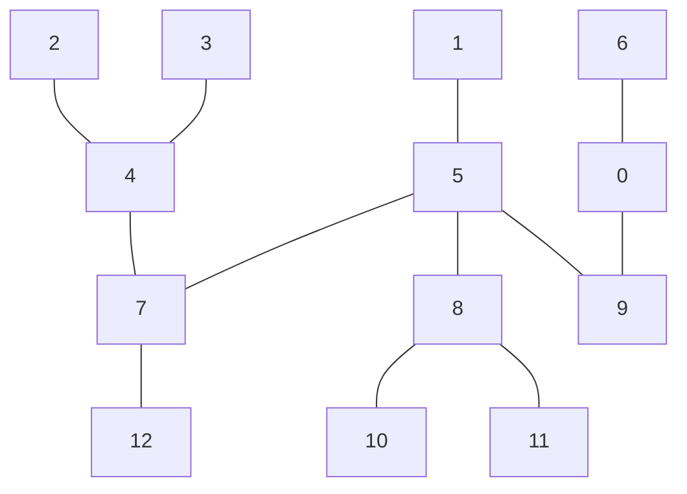

# Celaeno

<table>
  <tr>
    <td style="text-align: center" width="9999">
      
    </td>
  </tr>
</table>


[[_TOC_]]

## Algorithms

### Breadth-First Search

<details>
<summary>Breadth-First Search Example</summary>

```mermaid
graph TB;
	1 --- 5
	2 --- 4
	3 --- 4
	6 --- 9
	4 --- 7
	5 --- 7
	5 --- 8
	5 --- 9
	7 --- 12
	8 --- 10
	8 --- 11
````

```cpp
#include <iostream>
#include <map>
#include <cstdlib>
#include <range/v3/all.hpp>
#include <celaeno/graph/bfs.hpp>

int main()
{
  namespace rg = ranges;
  namespace rv = ranges::views;
  namespace bfs = celaeno::graph::bfs;

  // Create a simple graph
  std::multimap<int32_t,int32_t> graph
  {
    {1,5},{2,4},{3,4},{6,9},
    {4,7},{5,7},{5,8},{5,9},
    {7,12},{8,10},{8,11},
  };

  // Create a lambda to obtain neighboring vertices
  auto neighbors = [&graph](auto&& v) -> std::vector<int32_t>
  {
    auto pred = graph
      | rv::filter([&v](auto&& e){ return e.second == v; })
      | rv::transform([](auto&& e){ return e.first; });
    auto succ = graph
      | rv::filter([&v](auto&& e){ return e.first == v; })
      | rv::transform([](auto&& e){ return e.second; });
    return rv::concat(succ,pred) | rg::to<std::vector>;
  };

  // OPTIONAL callback applied to each node in a breadth-first order
  // Must return boolean to continue, useful searching for a
  // specific node in a bfs order
  auto callback = [](auto&& e){ std::cout << e << ",";  return false;};

  // Run the bfs algorithm
  auto result {bfs::run(1, neighbors, callback)};

  return EXIT_SUCCESS;
} // main
```

Result:

`1,5,7,8,9,12,4,10,11,6,2,3,`

</details>

### Depth-First Search

<details>
<summary>Depth-First Search Example</summary>

```mermaid
graph TB;
	1 --- 5
	2 --- 4
	3 --- 4
	6 --- 9
	4 --- 7
	5 --- 7
	5 --- 8
	5 --- 9
	7 --- 12
	8 --- 10
	8 --- 11
````

```cpp
#include <iostream>
#include <map>
#include <cstdlib>
#include <range/v3/all.hpp>
#include <celaeno/graph/dfs.hpp>

int main()
{
  namespace rg = ranges;
  namespace rv = ranges::views;
  namespace dfs = celaeno::graph::dfs;

  // Create a simple graph
  std::multimap<int32_t,int32_t> graph
  {
    {1,5},{2,4},{3,4},{6,9},
    {4,7},{5,7},{5,8},{5,9},
    {7,12},{8,10},{8,11},
  };

  // Create a lambda to obtain neighboring vertices
  auto neighbors = [&graph](auto&& v) -> std::vector<int32_t>
  {
    auto pred = graph
      | rv::filter([&v](auto&& e){ return e.second == v; })
      | rv::transform([](auto&& e){ return e.first; });
    auto succ = graph
      | rv::filter([&v](auto&& e){ return e.first == v; })
      | rv::transform([](auto&& e){ return e.second; });
    return rv::concat(succ,pred) | rg::to<std::vector>;
  };

  // OPTIONAL callback applied to each node in a depth-first order
  // Must return boolean to continue, useful searching for a
  // specific node in a dfs order
  auto callback = [](auto&& e){ std::cout << e << ",";  return false;};

  // Run the dfs algorithm
  auto result {dfs::run(1, neighbors, callback)};

  return EXIT_SUCCESS;
} // main

```

Result:

 `1,5,9,6,8,11,10,7,4,3,2,12,`

</details>

### Topological Sorting

<details>
<summary>Graph Topological Sorting Example</summary>

```mermaid
graph TB;
	1 --- 5
	2 --- 4
	3 --- 4
	6 --- 9
	4 --- 7
	5 --- 7
	5 --- 8
	5 --- 9
	7 --- 12
	8 --- 10
	8 --- 11
````

```cpp
#include <iostream>
#include <map>
#include <cstdlib>
#include <range/v3/all.hpp>
#include <celaeno/graph/kahn.hpp>

int main()
{
  namespace rg = ranges;
  namespace rv = ranges::views;
  namespace kahn = celaeno::graph::kahn;

  // Create a simple graph
  std::multimap<int32_t,int32_t> graph
  {
    {1,5},{2,4},{3,4},{6,9},
    {4,7},{5,7},{5,8},{5,9},
    {7,12},{8,10},{8,11},
  };

  // Create a lambda to obtain predecessor vertices
  auto pred = [&graph](auto&& src) -> std::vector<int32_t>
  {
    return graph
    | rv::filter([&src](auto&& e){ return src == e.second; })
    | rv::transform([](auto&& e){ return e.first; })
    | rg::to<std::vector>;
  };

  // Create a lambda to obtain successor vertices
  auto succ = [&graph](auto&& src) -> std::vector<int32_t>
  {
    return graph
    | rv::filter([&src](auto&& e){ return src == e.first; })
    | rv::transform([](auto&& e){ return e.second; })
    | rg::to<std::vector>;
  };

  // Callback applied in a topological order to each vertex
  auto callback = [](auto&& e){ std::cout << e << ",";  return false;};

  // Run the topological sorting algorithm
  auto result {kahn::run(1, pred, succ, callback)};

  return EXIT_SUCCESS;
} // main
```

Result:

`1,6,2,3,5,4,8,9,7,10,11,12,`

</details>

### Graph Path Balancing

<details>
<summary>Graph Balancing Test</summary>

```mermaid
graph TB;
	1 --- 5
	2 --- 4
	3 --- 4
	6 --- 9
	4 --- 7
	5 --- 7
	5 --- 8
	5 --- 9
	7 --- 12
	8 --- 10
	8 --- 11
````

```cpp
#include <iostream>
#include <map>
#include <cstdlib>
#include <range/v3/all.hpp>
#include <celaeno/graph/balance.hpp>

int main()
{
  namespace rg = ranges;
  namespace rv = ranges::views;
  namespace balance = celaeno::graph::balance;

  // Create a simple graph
  std::multimap<int32_t,int32_t> graph
  {
    {1,5},{2,4},{3,4},{6,9},
    {4,7},{5,7},{5,8},{5,9},
    {7,12},{8,10},{8,11},
  };

  // Create a lambda to obtain predecessor vertices
  auto pred = [&graph](auto&& src) -> std::vector<int32_t>
  {
    return graph
    | rv::filter([&src](auto&& e){ return src == e.second; })
    | rv::transform([](auto&& e){ return e.first; })
    | rg::to<std::vector>;
  };

  // Create a lambda to obtain successor vertices
  auto succ = [&graph](auto&& src) -> std::vector<int32_t>
  {
    return graph
    | rv::filter([&src](auto&& e){ return src == e.first; })
    | rv::transform([](auto&& e){ return e.second; })
    | rg::to<std::vector>;
  };

  // Create a lambda to link vertices
  auto link = [&graph](auto&& e) -> void { graph.emplace(e); };

  // Create a lambda to unlink vertices
  auto unlink = [&graph](auto&& e) -> void
  {
    auto rng {graph.equal_range(e.first)};
    for (auto it{rng.first}; it != rng.second; ++it)
    {
      if( it->second == e.second )
      {
        graph.erase(it);
        break;
      }
    } // for: it != it.second
  };

  balance::run(1, pred, succ, link, unlink);

  return EXIT_SUCCESS;
} // main

```

Result:



</details>

### Graph Topological (Depth) View

<details>
<summary>Graph Topological View Example</summary>

```mermaid
graph TB;
	1 --- 5
	2 --- 4
	3 --- 4
	6 --- 9
	4 --- 7
	5 --- 7
	5 --- 8
	5 --- 9
	7 --- 12
	8 --- 10
	8 --- 11
````

```cpp
#include <iostream>
#include <map>
#include <cstdlib>
#include <range/v3/all.hpp>
#include <celaeno/graph/views/depth.hpp>

int main()
{
  namespace rg = ranges;
  namespace rv = ranges::views;
  namespace depth = celaeno::graph::views::depth;

  // Create a simple graph
  std::multimap<int32_t,int32_t> graph
  {
    {1,5},{2,4},{3,4},{6,9},
    {4,7},{5,7},{5,8},{5,9},
    {7,12},{8,10},{8,11},
  };

  // Create a lambda to obtain predecessor vertices
  auto pred = [&graph](auto&& src) -> std::vector<int32_t>
  {
    return graph
    | rv::filter([&src](auto&& e){ return src == e.second; })
    | rv::transform([](auto&& e){ return e.first; })
    | rg::to<std::vector>;
  };

  // Create a lambda to obtain successor vertices
  auto succ = [&graph](auto&& src) -> std::vector<int32_t>
  {
    return graph
    | rv::filter([&src](auto&& e){ return src == e.first; })
    | rv::transform([](auto&& e){ return e.second; })
    | rg::to<std::vector>;
  };

  // Returns a pair
  // 1 → level -> nodes
  // 2 → node -> level
  auto [lvns,nslv] = depth::run(1, pred, succ);

  return EXIT_SUCCESS;
} // main

```

Result:

`Level 0: [0,1] [0,6] [0,2] [0,3]`

`Level 1: [1,5] [1,4]`

`Level 2: [2,8] [2,9] [2,7]`

`Level 3: [3,10] [3,11] [3,12] `

</details>

### Adjacency Matrix

<details>
<summary>Adjacency Matrix Example</summary>

```mermaid
graph TB;
	1 --- 5
	2 --- 4
	3 --- 4
	6 --- 9
	4 --- 7
	5 --- 7
	5 --- 8
	5 --- 9
	7 --- 12
	8 --- 10
	8 --- 11
````

```cpp
#include <iostream>
#include <map>
#include <cstdlib>
#include <range/v3/all.hpp>
#include <celaeno/graph/matrix-realization.hpp>
#include <celaeno/graph/views/depth.hpp>

int main()
{
  namespace rg = ranges;
  namespace rv = ranges::views;
  namespace ra = ranges::actions;
  namespace depth = celaeno::graph::views::depth;
  namespace matrix_realization = celaeno::graph::matrix_realization;

  // Create a simple graph
  std::multimap<int32_t,int32_t> graph
  {
    {1,5},{2,4},{3,4},{6,9},
    {4,7},{5,7},{5,8},{5,9},
    {7,12},{8,10},{8,11},
  };

  // Create a lambda to obtain predecessor vertices
  auto pred = [&graph](auto&& src) -> std::vector<int32_t>
  {
    return graph
    | rv::filter([&src](auto&& e){ return src == e.second; })
    | rv::transform([](auto&& e){ return e.first; })
    | rg::to<std::vector>;
  };

  // Create a lambda to obtain successor vertices
  auto succ = [&graph](auto&& src) -> std::vector<int32_t>
  {
    return graph
    | rv::filter([&src](auto&& e){ return src == e.first; })
    | rv::transform([](auto&& e){ return e.second; })
    | rg::to<std::vector>;
  };

  // Returns a pair
  // 1 → level -> nodes
  // 2 → node -> level // not used in this algorithm
  auto [lvns,_] = depth::run(1, pred, succ);

  // Key type of the multimap
  using node_t = decltype(lvns)::key_type;

  // Lambda to obtain a layer by index
  auto get_level = [&lvns](node_t idx)
  {
    return lvns
      | rv::filter([&idx](auto&& e){ return e.first == idx; })
      | rv::values
      | rg::to<std::vector>
      | ra::sort;
  };

  // Lambda to verify if edge vu exists
  auto adjacent = [&graph](node_t v, node_t u)
  {
    if( graph.contains(v) )
    {
      auto rng {graph.equal_range(v)};
      for (auto it{rng.first}; it != rng.second; ++it)
      {
        if( it->second == u ) { return true; }
      } // for: it != rng.second
    }
    return false;
  };

  // Number of levels (depth) of the graph
  auto levels {(lvns | rv::keys | rv::unique | rg::to<std::vector>).size()};

  auto matrices { matrix_realization::run(get_level, adjacent, levels) };

  return EXIT_SUCCESS;
} // main
```

Result:

```
  M1      M2      M3
[0,1]  [1,0,0]  [0,0,1]
[1,0]  [1,1,1]  [1,1,0]
[1,0]           [0,0,0]
[0,0]
```

</details>

### Graph Edge Crossings Count

<details>
<summary>Graph Edge Crossings Count Example</summary>

```mermaid
graph TB;
	1 --- 5
	2 --- 4
	3 --- 4
	6 --- 9
	4 --- 7
	5 --- 7
	5 --- 8
	5 --- 9
	7 --- 12
	8 --- 10
	8 --- 11
````

```cpp
#include <iostream>
#include <map>
#include <cstdlib>
#include <range/v3/all.hpp>
#include <celaeno/graph/matrix-realization.hpp>
#include <celaeno/graph/crossings.hpp>
#include <celaeno/graph/views/depth.hpp>

int main()
{
  namespace rg = ranges;
  namespace rv = ranges::views;
  namespace ra = ranges::actions;
  namespace depth = celaeno::graph::views::depth;
  namespace matrix_realization = celaeno::graph::matrix_realization;
  namespace crossings = celaeno::graph::crossings;

  // Create a simple graph
  std::multimap<int32_t,int32_t> graph
  {
    {1,5},{2,4},{3,4},{6,9},
    {4,7},{5,7},{5,8},{5,9},
    {7,12},{8,10},{8,11},
  };

  // Create a lambda to obtain predecessor vertices
  auto pred = [&graph](auto&& src) -> std::vector<int32_t>
  {
    return graph
    | rv::filter([&src](auto&& e){ return src == e.second; })
    | rv::transform([](auto&& e){ return e.first; })
    | rg::to<std::vector>;
  };

  // Create a lambda to obtain successor vertices
  auto succ = [&graph](auto&& src) -> std::vector<int32_t>
  {
    return graph
    | rv::filter([&src](auto&& e){ return src == e.first; })
    | rv::transform([](auto&& e){ return e.second; })
    | rg::to<std::vector>;
  };

  // Returns a pair
  // 1 → level -> nodes
  // 2 → node -> level // not used in this algorithm
  auto [lvns,_] = depth::run(1, pred, succ);

  // Key type of the multimap
  using node_t = decltype(lvns)::key_type;

  // Lambda to obtain a layer by index
  auto get_level = [&lvns](node_t idx)
  {
    return lvns
      | rv::filter([&idx](auto&& e){ return e.first == idx; })
      | rv::values
      | rg::to<std::vector>
      | ra::sort;
  };

  // Lambda to verify if edge vu exists
  auto adjacent = [&graph](node_t v, node_t u)
  {
    if( graph.contains(v) )
    {
      auto rng {graph.equal_range(v)};
      for (auto it{rng.first}; it != rng.second; ++it)
      {
        if( it->second == u ) { return true; }
      } // for: it != rng.second
    }
    return false;
  };

  // Number of levels (depth) of the graph
  auto levels {(lvns | rv::keys | rv::unique | rg::to<std::vector>).size()};

  // Adjacency matrices
  auto ms = matrix_realization::run(get_level, adjacent, levels);

  // Return the number of crossings for each adjacency matrix
  auto f_sum = []<typename... T>(T&&... m){return (crossings::run(std::forward<T>(m)) + ...);};

  // Total number of crossings in the graph
  auto sum = f_sum(ms.at(0), ms.at(1), ms.at(2));

  return EXIT_SUCCESS;
} // main
```

Result:

`Crossings: 4`

The drawing of the example graph already used an algorithm for edge crossing minimization, that is why it has no crossings.

</details>

### Graph Crossings Minimization

### Barycenter Heuristic

### A* Path Finder

## Documentation

You can read the full API documentation in my  [gitlab pages](https://formigoni.gitlab.io/celaeno/).

For a quick summary, here's my list of implemented algorithms:

vim: set ts=2 sw=2 tw=0 et :
