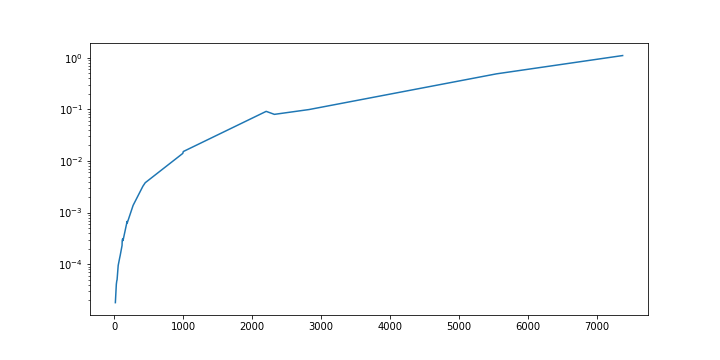
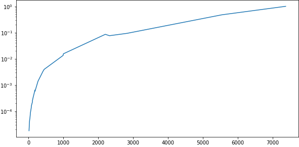
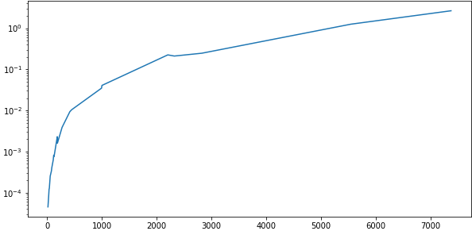
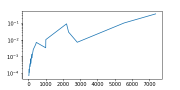
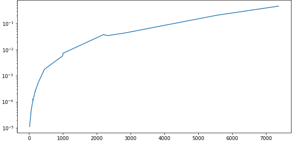
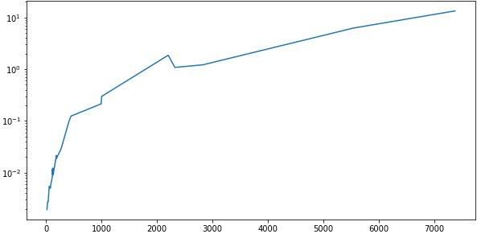
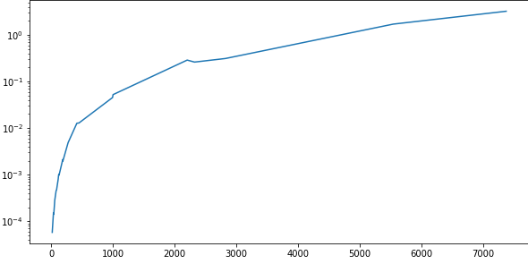
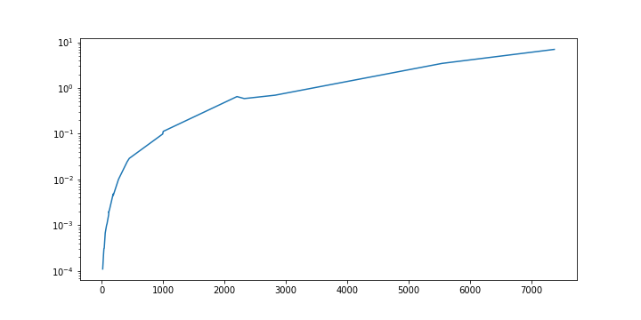

# Celaeno - A Modern Graph Algorithms Library


<!--  -->

Table of Contents:

[[_TOC_]]


## Implemented Algorithms:

- Reader
  - [x] Verilog
- Search
  - [x] Breadth-First Search
  - [x] Depth-First Search
  - [x] Topological Search
  - [x] A*
- Views
  - [x] Topological
- Representations
  - [x] Grid
  - [x] Incidence
- Operations
  - Count
    - [x] Crossings
  - Minimize
    - [x] Crossings
    - [x] Edge Length
    - [x] Dummy Nodes
- Draw
  - [x] SVG

## Integration

### Conan

To integrate celæno to a conan project, add the bintray remote with the command:

```sh
conan remote add celaeno https://api.bintray.com/conan/ruanformigoni/celaeno
```

In `conanfile.txt`, include the following:

```txt
[requires]
celaeno/0.1@ruanformigoni/testing

[generators]
cmake_find_package
cmake_paths

```

And in `CMakeLists.txt` include this line right after the project name:

```cmake
include(${CMAKE_BINARY_DIR}/conan_paths.cmake)
```

## Examples

<details>
<summary>Breadth-First Search</summary>

```cpp
#include <fmt/ranges.h>

#include <celaeno/aliases.hpp>
#include <celaeno/graph/graph.hpp>
#include <celaeno/graph/search/bfs.hpp>

// Using declarations
using namespace celaeno::aliases;

// namespaces
namespace graph = celaeno::graph;
namespace bfs = celaeno::graph::search::bfs;

i32 main()
{
  // Graph
  graph::Graph<i64> g
  {
    {1,5},{2,4},{3,4},{6,9},
    {4,7},{5,7},{5,8},{5,9},
    {7,12},{8,10},{8,11},
  };

  // Required behaviors
  auto f_pred = [&g](auto&& u){ return g.predecessors(u); };
  auto f_succ = [&g](auto&& u){ return g.successors(u); };

  // Run algorithm
  auto search {bfs::run(1,f_pred,f_succ)};

  // Print Result
  fmt::print("Bfs ordering: {}\n", search);

  return 0;
} // main
```

Result:

`1,5,7,8,9,12,4,10,11,6,2,3,`

</details>

<details>
<summary>Graph SVG Writer</summary>

**TODO**

</details>

## Documentation

:speech_balloon: You can read the full library documentation [here](https://formigoni.gitlab.io/celaeno/).

Algorithms information:

| Class                  | Algorithm | Execution |
|:----------------------:|:-----:|:---------:|
| Reader |  Verilog |  |
| Search | Breadth-First Search |  |
| Search |  Depth-First Search |  |
| Search |  Topological Sorting |  |
| View |  Topological |  |
| View |  Proximity |  |
| Representation |  Incidence |  |
| Operation |  Balance Outcoming Edges |  |
| Operation |  Balance Paths |  |
| Operation |  Count Crossings |  |
| Operation |  Minimize Crossings |  |

## Benchmarks

<table>
  <tr>
    <td style="text-align: center" width="9999">
      Breadth-First Search
      
    </td>
    <td style="text-align: justify" width="9999">
      Depth-First Search
      
    </td>
    <td style="text-align: justify" width="9999">
      Topological Search
      
    </td>
  </tr>
  <tr>
    <td style="text-align: center" width="9999">
      Balance Paths
      
    </td>
    <td style="text-align: justify" width="9999">
      Count Edge Crossings
      
    </td>
    <td style="text-align: justify" width="9999">
      Minimize Edge Crossings
      
    </td>
  </tr>
  <tr>
    <td style="text-align: center" width="9999">
      Topological (Depth) View
      
    </td>
    <td style="text-align: justify" width="9999">
      Proximity View
      
    </td>
  </tr>
</table>


## Made Possible With

<table>
<tr>
<td style="text-align: center" width="9999">
[doctest](https://github.com/onqtam/doctest)
</td>
<td style="text-align: center" width="9999">
[range-v3](https://github.com/ericniebler/range-v3)
</td>
<td style="text-align: center" width="9999">
[functionalplus](https://github.com/Dobiasd/FunctionalPlus/)
</td>
<td style="text-align: center" width="9999">
[fmtlib](https://github.com/fmtlib/fmt)
</td>
<td style="text-align: center" width="9999">
[spdlog](https://github.com/gabime/spdlog)
</td>
</tr>
</table>
