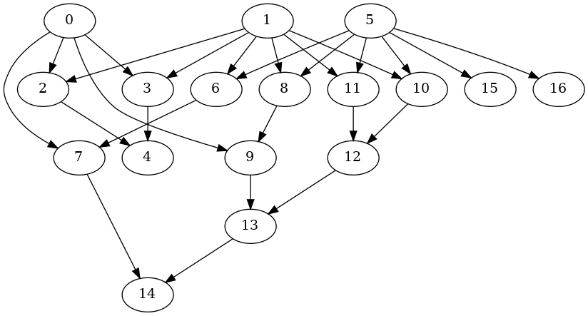

# Breadth-First Search

## Definition

From the book Introduction to Algorithms, 3rd Edition:

> Given a graph G = (V,E) and a distinguished source vertex s, breadth-first
search systematically explores the edges of G to “discover” every vertex that
is reachable from s. It computes the distance (smallest number of edges) from s
to each reachable vertex. It also produces a “breadth-first tree” with root s
that contains all reachable vertices. For any vertex  reachable from s, the
simple path in the breadth-first tree from s to  corresponds to a “shortest
path” from s to in G, that is, a path containing the smallest number of edges.
The algorithm works on both directed and undirected graphs.

_Cormen, Thomas H., and Charles E. Leiserson. Introduction to Algorithms, 3rd
Edition. 2009._

## Video Animation:

<iframe width="750" height="500" src="https://www.youtube.com/embed/9AEFRkI2SHA" frameborder="0" allow="accelerometer; autoplay; encrypted-media; gyroscope; picture-in-picture" allowfullscreen></iframe>

## Pseudo-Code

```cpp
bfs(root, adj, callback)
{
  // Queue of vertices
  Queue queue;

  // Visited vertices
  Set visited; // Using std::set for log(n) query

  // Result that contains all the visited vertices
  Vector result;

  // Push initial vertex into the queue
  queue.push(root);

  while( ! queue.empty() )
  {
    // Get next vertex
    vertex {queue.front()}; queue.pop();

    // Skip visited vertices
    if( visited.contains(vertex) ) continue;

    // Insert the vertex in the result
    result.push_back(vertex);

    // Mark as visited
    visited.insert(vertex);

    // Remove the visited ones
    is_visited = lambda v: return visited.contains(v);
    not_visited { apply(adj(vertex), drop_if(is_visited)) };

    // Insert non-visited into the queue
    for_each(not_visited, queue.push(v));

    // Execute callback on current vertex
    if ( callback(vertex) ) return result;
  }
  return result;
}
```

## Usage

### Graph to transverse



> BFS Result: 0,2,3,7,9,4,1,14,6,13,8,10,11,5,12,15,16

### Sample usage

```cpp
/* vim: set expandtab fdm=marker ts=2 sw=2 tw=80 et :*/

#include <iostream>
#include <celaeno/graph/bfs.hpp>
#include <taygete/graph/graph.hpp>
#include <taygete/graph/reader.hpp>
#include <maia/circuits/synth-91.hpp>

//
// Aliases
//

namespace bfs = celaeno::graph::bfs;
namespace cir = maia::circuits::synth_91;
namespace gra = taygete::graph;
using float64_t = double;

int main(int argc, char const* argv[])
{
  // Create an empty graph with the taygete library or any other graph library
  gra::Graph<int64_t> g;

  // Create a lambda to instruct how to insert nodes in the graph library
  auto emplace = [&g](auto&& pair){ g.emplace(pair); };

  // Create a lambda to instruct how to obtain adjacent nodes in the library
  auto adj = [&g](auto&& v){ return g.get_adjacent(v); };

  // Read a graph from the verilog examples in the maia library. The first
  // parameter is the verilog string, the second is the insertion lambda.
  gra::reader::Reader reader{cir::b1,emplace};

  // Perform the bfs
  auto bfs {bfs::bfs(0,adj)};

  return EXIT_SUCCESS;
}
```
