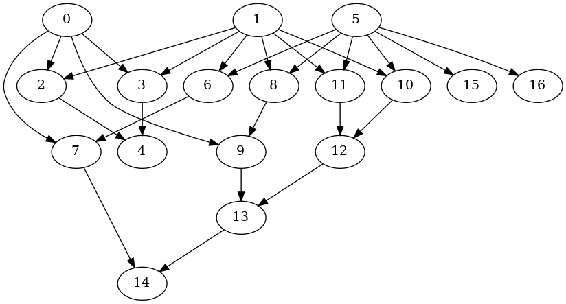

>  vim: set expandtab fdm=marker ts=2 sw=2 tw=80 et :

# Depth-First Search

## Definition

> The strategy followed by depth-first search is, as its name implies, to search
“deeper” in the graph whenever possible. Depth-first search explores edges out
of the most recently discovered vertex  that still has unexplored edges
leaving it.  Once all of ’s edges have been explored, the search “backtracks”
to explore edges leaving the vertex from which  was discovered. This process
continues until we have discovered all the vertices that are reachable from the
original source vertex.

_Cormen, Thomas H., and Charles E. Leiserson. Introduction to Algorithms, 3rd
Edition. 2009._

## Instructional Video:

<iframe width="750" height="500" src="https://www.youtube.com/embed/7fujbpJ0LB4" frameborder="0" allow="accelerometer; autoplay; encrypted-media; gyroscope; picture-in-picture" allowfullscreen></iframe>


## Interface

> <i class="fa fa-bars" style="color:steelblue"></i>&nbsp;&nbsp;
template<SignedIntegral T, Fn F1, Fc F2 = std::function<bool(int64_t)>>
>
> <i class="fa fa-bars" style="color:steelblue"></i>&nbsp;&nbsp;
> std::vector<T> dfs(T&& root, F1&& adj, F2&& cb = [](auto&&){return false;})

## Parameters

> <i class="fa fa-cog" style="color:steelblue"></i>&nbsp;&nbsp;
> root: A Signed integral.
>
> <i class="fa fa-cog" style="color:steelblue"></i>&nbsp;&nbsp;
> adj: `T → [T...]` A lambda to return adjacent nodes.
>
> <i class="fa fa-cog" style="color:steelblue"></i>&nbsp;&nbsp;
> cb: `T → bool` An optional callback to call in a depth-first manner.
> The search stops if the condition returns true or all nodes
> have been explored.

## Constraints
```cpp
template<typename T>
concept Iterable = requires{ std::input_iterator<T> && std::incrementable<T>; };

template<typename T>
concept SignedIntegral = std::signed_integral<T>;

template<typename T>
concept Fn = requires(T t){ {t(int64_t{})} -> Iterable; };

template<typename T>
concept Fc = requires(T t){ {t(int64_t{})} -> std::same_as<bool>; };
```


## Usage

For a complete example of CMake and dependencies integration, see:
[DFS Project Example](https://gitlab.com/formigoni/celaeno/-/raw/development/doc/mdbook/archives/sample-dfs.tar.xz)

To compile the example use:
```sh
// Create build directory
mkdir build && cd build
// Configure conan
conan install -s compiler=gcc -s compiler.version=10 -s compiler.libcxx=libstdc++11 .. && cd ..
// Configure CMake
cmake -H. -Bbuild
// Build the project
cmake --build build
// Run the executable
./build/bin/main
```
> BFS Result: 0,9,8,5,16,15,11,1,10,12,13,14,7,6,3,4,2,

> _Transversed graph:_
> 
> 
