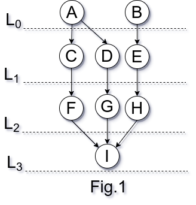

# Incidence Matrix

<!-- toc -->

## Definition

> An _incidence matrix_ representation for a simple graph \\(G(V,E)\\) is a
matrix \\(I\\), where:

\\[ I[u,v] =
  \\begin{cases}
    1\\text{ if edge uv exists} \\\\
    0\\text{ otherwise}
  \\end{cases}
\\]

Consider the two-layered graph shown in Figure 1.

<center>

</center>

There is one incidence matrix \\(I_0\\) between levels \\(L_0\\) and \\(L_1\\),
another matrix \\(I_1\\) between levels \\(L_1\\) and \\(L_2\\), and, lastly,
matrix \\(I_2\\) between levels \\(L_2\text{ and }L_3\\). These are
depicted as follows:

\\[ I_0 =
  \\left[
    \\begin{array}[ccc]
    {}1 & 1 & 0 \\\\
     0 & 0 & 1
    \\end{array}
  \\right]
\\]

Where the rows are \\(a\\) and \\(b\\) and the columns,
\\(c,d\text{ and }e\\), respectively.

\\[ I_1 =
  \\left[
    \\begin{array}[ccc]
    {}1 & 0 & 0 \\\\
     0 & 1 & 0 \\\\
     0 & 0 & 1
    \\end{array}
  \\right]
\\]

Where the rows are \\(c,d\text{ and }e\\), and the columns,
\\(f,g\text{ and }h\\), respectively.

\\[ I_2 =
  \\left[
    \\begin{array}[c]
    {}1 \\\\
      1 \\\\
      1 
    \\end{array}
  \\right]
\\]

Lastly, matrix \\(L_2\\) Where the rows are \\(f,g\text{ and }h\\), and the
column, is \\(I\\), respectively.

## Interface

```cpp
template<SignedIntegral T, typename P, typename S, typename A>
auto run(T root, P&& f_pred, S&& f_succ, A&& f_adj)
  requires CallableWith<P,i64>
  &&
  CallableWith<S,i64>
  &&
  CallableWith<A,i64,i64>
```

## Example with [Taygete](https://gitlab.com/formigoni/taygete)

```cpp
#include <iostream>
#include <cstdlib>
#include <fmt/core.h>
#include <fmt/ranges.h>
#include <taygete/graph/graph.hpp>
#include <celaeno/aliases.hpp>
#include <celaeno/graph/representations/incidence.hpp>


// namespaces {{{
namespace graph = taygete::graph;
namespace incidence = celaeno::graph::representations::incidence;
// }}}

int main()
{
  // Graph {{{
  graph::Graph<i64> g
  {
    {1,5},{2,4},{3,4},{6,9},
    {4,7},{5,7},{5,8},{5,9},
    {7,12},{8,10},{8,11},
  };
  // }}}

  // Required behaviors {{{
  auto p = [&g](auto&& u){ return g.predecessors(u); };
  auto s = [&g](auto&& u){ return g.successors(u); };
  // }}}

  // Run algorithm {{{
  auto matrices {incidence::run(1,p,s)};
  // }}}

  // Print incidence matrices {{{
  fmt::print("Incidence Matrices: \n");
  for (auto&& m : matrices)
  {
    for (auto&& v : m)
    {
      fmt::print("{}\n",v);
    } // for v : m
    fmt::print("\n--------\n");
  } // for m : matrices }}}

  return EXIT_SUCCESS;
} // main
```

Result:
```shell
Incidence Matrices: 
{0, 1, 0}
{1, 0, 0}
{1, 0, 0}

--------
{1, 0, 0}
{1, 1, 1}
{0, 0, 1}

--------
{0, 0, 1}
{1, 1, 0}
{0, 0, 0}

--------
```

<!-- vim: set expandtab fdm=marker ts=2 sw=2 tw=80 et : -->
