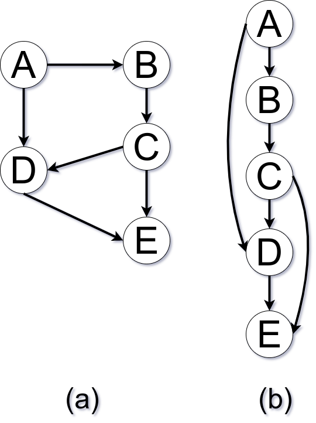

# Topological Sorting

## Definition

<!-- toc -->

> A topological sorting algorithm is used with a digraph \\(G=(V,E)\\) , the
goal is to find a linear ordering of vertices, s.t., for all edges (u, v) in E,
u precedes v in the ordering.

<p style="text-align: center">

</p>

The graph from figure _a_ is in a topological sorted order in figure _b_, since
for every edge _uv_, u precedes _v_.

_[1] A. B. Kahn. 1962. Topological sorting of large networks. Commun. ACM 5, 11 (Nov. 1962), 558–562. DOI:https://doi.org/10.1145/368996.369025_

_[2] https://courses.cs.washington.edu/courses/cse326/03wi/lectures/RaoLect20.pdf_

## Interface

```cpp
template<SignedIntegral T, typename P, typename S, typename C = std::function<bool(int64_t)>>
std::vector<T> run(T root, P&& f_pred, S&& f_succ, C&& cb = [](auto&&){return false;})
  requires CallableWith<P,i64>
  && CallableWith<S,i64>
  && CallableWith<C,i64>
```

## Example with [Taygete](https://gitlab.com/formigoni/taygete)

```cpp
#include <iostream>
#include <cstdlib>
#include <fplus/fplus.hpp>
#include <fmt/ranges.h>
#include <taygete/graph/graph.hpp>
#include <celaeno/aliases.hpp>
#include <celaeno/graph/search/kahn.hpp>


// namespaces {{{
namespace fp = fplus;
namespace graph = taygete::graph;
namespace kahn = celaeno::graph::search::kahn;
// }}}

int main()
{
  // Graph {{{
  graph::Graph<i64> g
  {
    {1,5},{2,4},{3,4},{6,9},
    {4,7},{5,7},{5,8},{5,9},
    {7,12},{8,10},{8,11},
  };
  // }}}

  // Required behaviors {{{
  auto p = [&g](auto&& u){ return g.predecessors(u); };
  auto s = [&g](auto&& u){ return g.successors(u); };
  // }}}

  // Run algorithm {{{
  auto result {kahn::run(1,p,s)};
  // }}}

  // Print topological ordering {{{
  fmt::print("Topological ordering: {}\n", result);
  // }}}

  return EXIT_SUCCESS;
} // main
```

Output:
```shell
Topological ordering: {1, 6, 2, 3, 5, 4, 8, 9, 7, 10, 11, 12}
```

<!-- vim: set expandtab conceallevel=0 fdm=marker ts=2 sw=2 tw=80 et : -->
<!-- vim: set expandtab fdm=marker ts=2 sw=2 tw=80 et : -->
