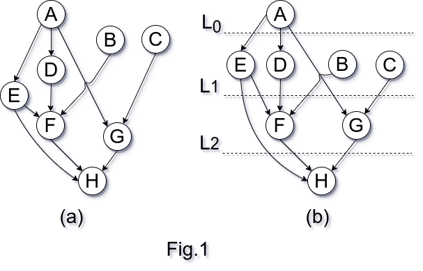

# Definition

> Give a graph \\(G(V,E)\\) a proximity view of a graph, is a representation,
such that, for every edge _uv_ of a vertex _u_, the layer of the vertex is
determined by the closest successor vertex. Figure 1a shows the input graph
for the algorithm, and the output is represented is Figure 2a, which satisfies
the previously constraint for every vertex.

<!-- vim: set expandtab fdm=marker ts=2 sw=2 tw=80 et : -->
